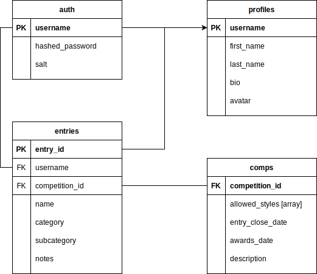

# HomeBrew Comps

It's an app for managing a homebrew club's competitions and user profiles.

Run `yarn dev` in the frontend-svelte folder for the latest frontend. The react one was a legacy experiment I'm still moving code out of.

## Functionality

### implementing/Implemented

#### Auth (uservice)

Handles authentication and Authorization for the app.

#### Profile (uservice)

Handles user profiles, a short bio, avatars etc.

#### Comps (uservice)

Handles advertising/registering for competitions.

#### Entries (uservice)

Handles entries for competitions, they are owned by users and the status' can be tracked from a state of registration, to submitted, to payed, to scored.

### Planned

see ./docs/features.md

## Architecture

The backend uses a microservices architecture where all internal calls between microservices are routed using rabbitMQ and any externally facing API's are implemented as REST API's running in containers. There are certain fields that are important for calling data between services they are shown in the data architecture below.



The front end is written in react.

## Usage

```bash
git clone https://github.com/schlerp/hbc.git

cd hbc

docker-compose up

# navigate to http://localhost:3000 in browser
```

## authors

- Patrick Coffey (schlerp)
- Matt Elvey (melvey)


